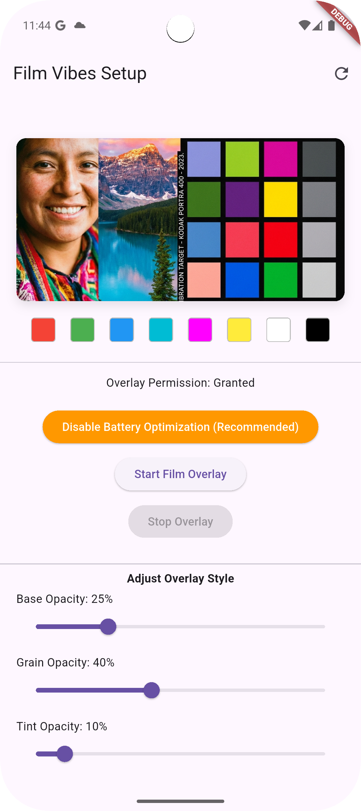
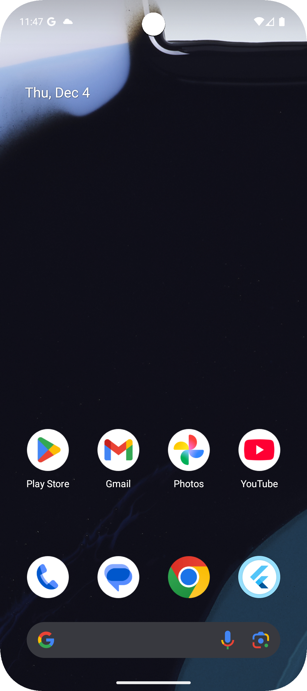
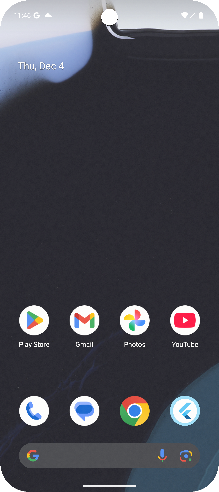

# Film Vibes 🎞️

A Flutter application that brings a warm, analog paper-like aesthetic to your entire Android experience.

## Overview

Film Vibes creates a system-wide overlay that sits on top of all your apps, applying a customizable film grain and paper texture effect. It's designed to make your digital screen feel more organic and less harsh.

## Screenshots

| App Configuration | Before (Off) | After (On) |
|:---:|:---:|:---:|
|  |  |  |
| *Adjusting the vibe* | *Standard Look* | *With Film Vibes* |

## Features

- **System-Wide Overlay**: The effect persists across all apps and the home screen.
- **Customizable Aesthetics**:
  - **Base Tint**: Adjust the warmth of the paper base.
  - **Grain**: Control the intensity of the film grain texture.
  - **Warmth**: Fine-tune the color temperature.
- **Battery Optimization**: Built-in handling to ensure the overlay persists in the background.

## Getting Started

1. **Install the App**: Build and install the APK on your Android device.
2. **Grant Permissions**:
   - **Display Over Other Apps**: Required to show the overlay.
   - **Disable Battery Optimization**: Recommended to prevent the system from killing the overlay process.
3. **Customize**: Use the sliders in the main app to dial in your perfect vibe.

## Development

- **`lib/main.dart`**: The configuration app UI.
- **`lib/overlay_main.dart`**: The actual overlay UI rendered by the system service.
- **`android/`**: Contains the native Kotlin implementation for the `WindowService`.

## Note

This application is designed specifically for **Android** due to the usage of system-level window overlays.
